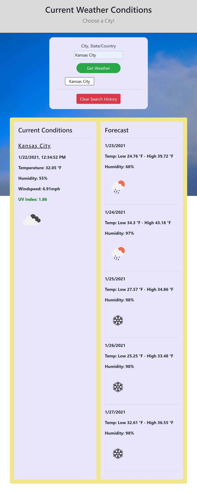

>## Weather Dashboard
---
For this project I have built a responsive weather forecasting dashboard for conveniently checking the weather in your desired city!

The Dashboard features
- The current forecast at location and a five day forecast to the right
- current conditions include a color coded UV index to indicate severity
- both current and forecast conditions include a small interpretive icon to communicate overall weather conditions
- integreated search history in the form of persistent clickable links, which can be cleared with the red button at the bottom of the history list
- the site will rerun your most recent search history upon being opened so you don't need to continually search your favorite location
- also displays local time at destination
- functionality powered by [Open Weather Map](https://openweathermap.org/)

---

>#### Please find the link and screenshot below! Thanks for viewing!

[Weather Dashboard](https://jpeyton-hub.github.io/WeatherDashboard/)

